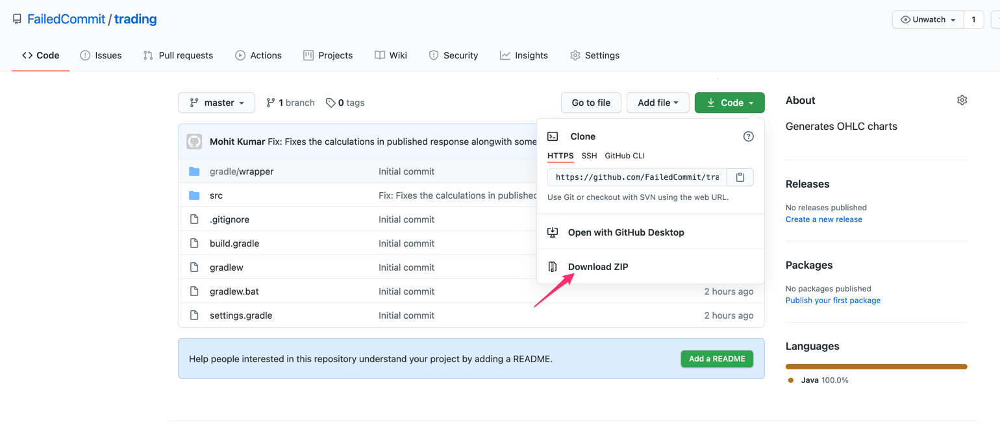
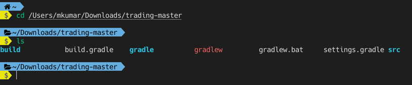
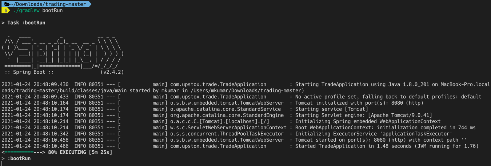
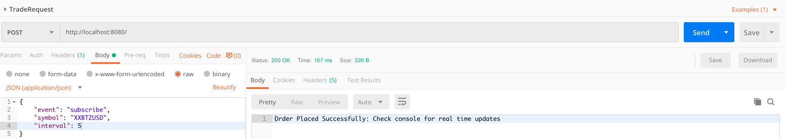

# trading
Generates OHLC charts

# Getting Started

### Download Source code
1. Go to: https://github.com/FailedCommit/trading
2. Unzip at your preferred location

### Prepare the terminal

cd into the root of the project

refer: 

### Start the project

./gradlew bootRun

### Hit the API

cURL:

curl -X POST \
http://localhost:8080/ \
-H 'Content-Type: application/json' \
-d '{
"event": "subscribe",
"symbol": "XXBTZUSD",
"interval": 5
}'

